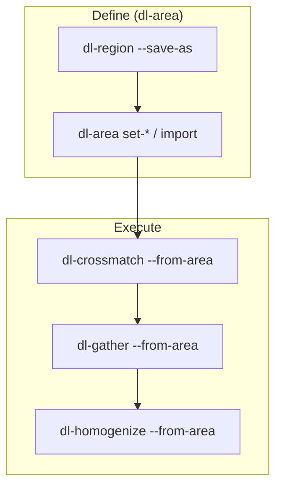

# Area plans (`dl-area`)

`dl-area` manages **`areas/<area_id>.json`** — metadata-only files that bundle a
sky **region** with optional **crossmatch**, **gather**, and **homogenize**
plans. It sits between [`dl-region`](regions-and-areas.md) (save/discover a
region) and the execution commands
[`dl-crossmatch`](crossmatch.md), [`dl-gather`](gather.md), and
[`dl-homogenize`](../homogenization.md).

Use `dl-area` when you want reproducible multi-survey workflows without
hand-editing JSON. For the full pipeline see
[Reference workflow](workflow.md).

## Quick start

```bash
export DATA_LAKE_CONFIG=/path/to/lake_config.toml

# 1. Save the sky selection (region only)
dl-region --cone 150.1 2.2 --radius-arcsec 600 --save-as MyCone

# 2. Attach plans
dl-area set-crossmatch MyCone --base EUCLID_DR1 \
  --partner DESI_DR1:1.0 --partner ALLWISE:2.0

dl-area set-gather MyCone --base EUCLID_DR1 \
  --columns '{"EUCLID_DR1":["ra","dec"],"DESI_DR1":["z"],"ALLWISE":["w1mpro"]}' \
  --materialize-as euclid_native_v1

dl-area set-homogenize MyCone --from-product euclid_native_v1 \
  --transform phot_ab_v1 --materialize-as euclid_ab_v1

# 3. Validate, then run downstream commands
dl-area validate MyCone
dl-crossmatch --from-area MyCone
dl-gather --from-area MyCone
dl-homogenize --from-area MyCone
```

**One-shot import** from the bundled example (creates the area if missing):

```bash
dl-area import multi_survey_cone \
  --from-file examples/areas/multi_survey_cone.example.json \
  --create-region
```

When `$DATA_LAKE_CONFIG` is set, the lake root positional is optional on all
`dl-area` subcommands (same as `dl-region`, `dl-gather`, …).

## Commands

| Subcommand | Purpose |
|------------|---------|
| `list` | List area ids under `areas/` |
| `show AREA` | Human-readable summary (`--json` for full file) |
| `validate AREA` | Lint the area schema (errors exit non-zero) |
| `set-crossmatch AREA` | Write or replace `crossmatch_plan` |
| `set-gather AREA` | Write or replace `gather` |
| `set-homogenize AREA` | Write or replace `homogenize` |
| `import AREA` | Merge blocks from a JSON file |

### `list` / `show` / `validate`

```bash
dl-area list
dl-area show MyCone
dl-area show MyCone --json
dl-area validate MyCone
```

`validate` reports `ERROR` (fatal) and `WARN` (advisory) messages — e.g.
missing partner radius, invalid gather multiplicity, homogenize block missing
`transform`.

### `set-crossmatch`

Defines the plan consumed by `dl-crossmatch --from-area`.

```bash
dl-area set-crossmatch MyCone \
  --base EUCLID_DR1 \
  --partner ALLWISE:2.0 \
  --partner DESI_DR1:col:desi_tid:TARGETID:TARGETID
```

| Flag | Required | Meaning |
|------|----------|---------|
| `--base` | yes | Base catalog survey (HEALPix partitioning for the match). |
| `--partner` | yes (repeat) | Sky: `SURVEY:RADIUS_ARCSEC`. Column equality: `SURVEY:col:COL_A:COL_B`. |
| `--no-reuse-existing` | no | Set `reuse_existing: false` (rebuild all tiles). |

Written JSON shape (same as hand-edited areas):

```json
"crossmatch_plan": {
  "base_catalog": "EUCLID_DR1",
  "partners": [
    { "survey": "ALLWISE", "match_mode": "sky", "radius_arcsec": 2.0 },
    {
      "survey": "DESI_DR1",
      "match_mode": "column",
      "match_col_a": "TARGETID",
      "match_col_b": "TARGETID"
    }
  ],
  "reuse_existing": true
}
```

`dl-gather --from-area` resolves sky trees by radius and column trees by column pair.

See [Crossmatch — region-bounded plans](crossmatch.md#region-bounded-plans---from-area---plan).

### `set-gather`

Defines the wide product catalog materialised by `dl-gather --from-area`.

```bash
dl-area set-gather MyCone \
  --base EUCLID_DR1 \
  --columns '{"EUCLID_DR1":["ra","dec"],"DESI_DR1":["z"]}' \
  --materialize-as euclid_native_v1 \
  --where-joined "DESI_DR1_z > 0.5"
```

| Flag | Default | Meaning |
|------|---------|---------|
| `--base` | — | Base catalog; defines row set and tiling. |
| `--columns` | — | JSON `{survey: [native_col, …]}`. Use `dl-describe-survey` for names. |
| `--materialize-as` | — | Product name (written to `products/<name>/`). |
| `--multiplicity` | `nearest` | `nearest` or `all` (fan-out matches). |
| `--matches-only` | off | Set `keep_all: false`. |
| `--no-sep` | off | Omit `<survey>_sep_arcsec` columns. |
| `--where-joined` | — | SQL on joined (prefixed) partner columns. |

Partner match radii come from `crossmatch_plan` on the same area — run
`set-crossmatch` first (or ensure radii exist in the imported JSON).

See [Gather — area JSON](gather.md#area-json-gather-block) for output column
naming (`DESI_DR1_z`, …).

### `set-homogenize`

Defines the homogenized product run by `dl-homogenize --from-area`.

**From a gathered product** (typical after `dl-gather`):

```bash
dl-area set-homogenize MyCone \
  --from-product euclid_native_v1 \
  --transform phot_ab_v1 \
  --materialize-as euclid_ab_v1
```

**From a native survey** (single-survey AB catalog in the area region):

```bash
dl-area set-homogenize MyCone \
  --survey ALLWISE \
  --transform phot_ab_v1 \
  --materialize-as allwise_ab_v1
```

Provide exactly one of `--survey` or `--from-product`. The CLI adds
`"region": {"from_area": "<area_id>"}` so homogenization is bounded to the
area's sky selection.

### `import`

Merge plan blocks from a JSON file into an existing area, or create a new area
when combined with `--create-region`:

```bash
# Merge crossmatch + gather + homogenize into an existing area
dl-area import MyCone --from-file my_plans.json

# Create area from full template (must include "region")
dl-area import multi_survey_cone \
  --from-file examples/areas/multi_survey_cone.example.json \
  --create-region
```

The file may be a **full area** or a **partial fragment** with any subset of:
`region`, `discover`, `crossmatch_plan`, `gather`, `homogenize`. Existing
blocks on the area are replaced when the same keys appear in the import file.

## Relationship to other commands



| Area block | Consumed by |
|------------|-------------|
| `region` | `dl-region --from-area`, bounds all `--from-area` runs |
| `crossmatch_plan` | `dl-crossmatch --from-area` |
| `gather` | `dl-gather --from-area` |
| `homogenize` | `dl-homogenize --from-area` |
| `discover` | Default scope for `dl-region --from-area` (surveys/modalities) |

`dl-region --save-as` writes **only** `region` (+ optional `discover`). Use
`dl-area` for the plan blocks.

## File location and naming

- Path: `<lake_root>/areas/<area_id>.json`
- Area ids may be passed with or without `.json` / `.area` suffix.
- Legacy `areas/<id>.area.json` files are still resolved.

List areas in the lake summary:

```bash
dl-describe-lake --areas
```

## Python API

The CLI is a thin wrapper over:

```python
from data_lake.discovery.areas import load_area, save_area, validate_area
from data_lake.discovery.area_plan import (
    build_crossmatch_plan,
    build_gather_block,
    build_homogenize_block,
    update_area,
)

update_area(
    lake_root,
    "MyCone",
    crossmatch_plan=build_crossmatch_plan(
        "EUCLID_DR1", [("DESI_DR1", 1.0), ("ALLWISE", 2.0)],
    ),
)
```

## Related docs

- [Regions and areas](regions-and-areas.md) — region selectors, full area schema
- [Reference workflow](workflow.md) — end-to-end CLI sequence
- [`examples/areas/`](../../examples/areas/) — copy/import templates
- [`notebooks/14_discovery_workflow.ipynb`](../../notebooks/14_discovery_workflow.ipynb) — worked example
