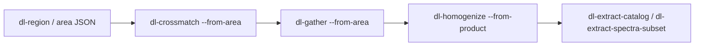

# Reference workflow: region → crossmatch → gather → homogenize → ML export

This page is the canonical end-to-end path for building a multi-survey training
set from a sky region. The worked example lives in
**[`notebooks/14_discovery_workflow.ipynb`](../../notebooks/14_discovery_workflow.ipynb)**;
copy the template area from
[`examples/areas/multi_survey_cone.example.json`](../../examples/areas/multi_survey_cone.example.json)
into your lake's `areas/` directory and edit survey/column names.

## Prerequisites

- Ingested **base** and **partner** catalogs for the surveys you need.
- `DATA_LAKE_CONFIG` pointing at your deployment (or pass lake root explicitly).
- Column names verified with `dl-describe-survey <name> --modality catalog`.

## Pipeline overview



| Step | Command | Output |
|------|---------|--------|
| 1. Region | `dl-region … --save-as AREA` | `areas/AREA.json` (region only) |
| 2. Plan | Edit area JSON | `crossmatch_plan`, `gather`, optional `homogenize` |
| 3. Crossmatch | `dl-crossmatch --from-area AREA` | `crossmatch/<A>_x_<B>__r<R>/` trees |
| 4. Gather | `dl-gather --from-area AREA` | `catalogs/<product>/` (`kind: product`) |
| 5. Homogenize | `dl-homogenize --from-product …` or `--from-area` | `catalogs/<ab_product>/` (`product_subtype: homogenized`) |
| 6. ML export | `dl-extract-catalog --from-product …` | Parquet/FITS + provenance sidecar |
| 7. Spectra (optional) | `dl-gather --extract-modalities` or `dl-extract-spectra-subset` | Zarr/HDF5 outside the lake |

**Note:** `dl-region --save-as` writes only the region (and optional `discover`
block). There is **no CLI yet** to attach `crossmatch_plan` / `gather` — copy
the example JSON or edit `areas/<id>.json` by hand until the Area CLI ships.

## Step-by-step (CLI)

```bash
export DATA_LAKE_CONFIG=/path/to/lake_config.toml
LAKE=$(python -c "from data_lake.config import LakeConfig; print(LakeConfig.discover().lake.root)")

# 1 — Save sky selection (or copy examples/areas/multi_survey_cone.example.json → $LAKE/areas/)
dl-region "$LAKE" --cone 150.1 2.2 --radius-arcsec 600 --save-as multi_survey_cone
# …then edit areas/multi_survey_cone.json (crossmatch_plan, gather, homogenize)

# 2 — Discover coverage (optional)
dl-region "$LAKE" --from-area multi_survey_cone

# 3 — Positional crossmatch (region-bounded, resumable)
dl-crossmatch "$LAKE" --from-area multi_survey_cone --n-workers 8 --progress

# 4 — Wide native product
dl-gather "$LAKE" --from-area multi_survey_cone

# 5 — AB homogenized product (from gathered wide table)
dl-homogenize --from-product euclid_north_native_v1 \
  --transform phot_ab_v1 --materialize-as euclid_north_ab_v1 \
  --from-area multi_survey_cone

# Or, if the area has a homogenize block:
dl-homogenize --from-area multi_survey_cone

# 6 — ML-ready Parquet
dl-extract-catalog --lake-root "$LAKE" \
  --from-product euclid_north_ab_v1 \
  -c _source_id -c ra -c dec -c ALLWISE_phot_ab_w1 -c DESI_DR1_z \
  -o /scratch/euclid_north_ab.parquet

# 7 — Spectra bundle (optional; DESI/SDSS: add --apply-survey-calibration)
dl-gather "$LAKE" --from-area multi_survey_cone \
  --extract-modalities spectra --output-dir /scratch/euclid_north_spectra \
  --extract-survey DESI_DR1
```

## Validation checkpoints

```bash
dl-describe-lake --kind product
dl-validate-homogenization --product euclid_north_ab_v1 --transform phot_ab_v1
dl-validate-homogenization --ab-coverage   # find missing phot_ab_v1 recipes
```

## Related docs

- [Regions and areas](regions-and-areas.md) — region selectors, area schema
- [Crossmatch](crossmatch.md) — match trees and `--from-area`
- [Gather](gather.md) — column naming, `--extract-modalities`
- [Homogenization](../homogenization.md) — `phot_ab_v1`, product provenance
- [Export and sharing](../export-and-sharing.md) — spectrum subset + flux calibration
