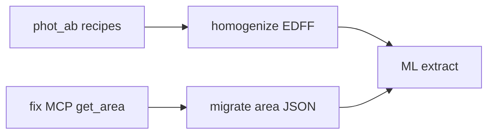

# Sprint: Lake COMO — July 2026

**Lake:** `/shared/como` (`DATA_LAKE_CONFIG=/home/sotiria/projects/como/lake_config.toml`)  
**Code release:** v0.4.3  
**Sprint window:** 2026-07-07 → 2026-07-21 (suggested)  
**MCP snapshot:** 2026-07-06 via `dl-mcp-lake` + `dl-mcp-docs`

This sprint plan was built from live MCP queries against COMO, cross-checked with
`TODO.md` and the v0.4.3 codebase.

---

## MCP health snapshot (COMO)

| Check | Result |
|-------|--------|
| Registry | 92 entries |
| Unfinalized live catalogs | none |
| Missing tile indices | none |
| Saved areas | `EDFF-test-01.area` (legacy filename: `areas/EDFF-test-01.area.json`) |
| Crossmatch trees (EUCLID_DR1 base) | ALLWISE, UNWISE_W1, GALEX_GR67, 2df, 6df |
| Gather products | `EDFF-test-01`, `EDFF_cone_joined` (~5.3M rows) |
| Homogenized products | `ALLWISE-TEST` only |
| Cutout layers | **none ingested** |

### Priority surveys on COMO

| Survey | Catalog rows | Spectra | `phot_ab_v1` recipe | Notes |
|--------|-------------|---------|---------------------|-------|
| EUCLID_DR1 | 29.2M | — | **missing** | EDFF base; order 6 |
| DESI_DR1 | 28.4M | 3,959 tiles, shared λ | **missing** | 7,781 pix; extract cal bundled |
| SDSS_DR17 | 5.8M | 1,244 tiles, shared λ | **missing** | 4,668 pix; extract cal bundled |
| ALLWISE | 747M | — | **ready** | Partner in EDFF |
| UNWISE_W1/W2 | 2.3B / 1.3B | — | **ready** | Partners in EDFF |
| 2df | 270k | 2 tiles, **per_source** λ | **missing** | Blocks subset extract |
| 6df | 113k | 28 tiles, **per_source** λ | **missing** | Blocks subset extract |

`dl-validate-homogenization --ab-coverage` reports **24** ingested catalogs without
`phot_ab_v1` on COMO (full list in backlog item H1).

### MCP tooling gaps found this sprint

1. **`get_area` / `estimate_operation_cost --from-area`** fail for `EDFF-test-01` because the file is `EDFF-test-01.area.json` and MCP passes `EDFF-test-01` — `resolve_area_path` should find legacy names (verify MCP tool vs CLI).
2. **`describe_lake` spectra** entries show `wavelength_mode: null` in registry JSON even though `spectrum_info.json` has values — refresh registry or enrich describe output.

---

## TODO.md audit (code vs backlog)

| Item | TODO status | Code / COMO reality |
|------|-------------|----------------------|
| Reference workflow notebook + docs | [x] | **Done** — `notebooks/14_discovery_workflow.ipynb`, `docs/discovery/workflow.md` |
| `dl-area` CLI | [x] | **Done** — `area_cli.py`, `docs/discovery/areas-cli.md` |
| Spectra extract calibration | [x] | **Done** — SDSS/DESI JSON + `--apply-survey-calibration` |
| MOC export | [x] | **Done** — `dl-region --export-moc`, `dl-export-moc` |
| `phot_ab_v1` for ingested catalogs | open | **In progress (you)** — 24 gaps on COMO; bundled recipes for VISTA/UNWISE/GAIA/ALLWISE only |
| `cutout_njy_v1` | open | Transform pack exists; only `synthetic.json` has rules; **no COMO cutouts** → defer |
| Homogenize e2e on real tiles | open | Fixtures only in `tests/test_homogenize.py` |
| `wavelength_mode != shared` extract | open | **`NotImplementedError`** in `SpectrumAccessor._prepare_subset_plan` — blocks **2df/6df** on COMO |
| Query-time `build_homogenized_view_sql` | open | Function exists in `homogenize/transforms.py` + unit test; **not** a first-class `dl-homogenize` / CLI path |
| Column overlays | open | Only `ALLWISE.catalog.json` in `shared/registry/overlays/`; all COMO surveys `has_column_overlay=false` |
| MCP read-only team docs | open | **Partial** — `docs/mcp-lake.md` § Out of scope; no deployment runbook |
| MCP authentication | open | Not started; ingest token only |

---

## Sprint goals

1. **Ship AB homogenization for COMO science path** — EUCLID + DESI + SDSS recipes; homogenize `EDFF_cone_joined`.
2. **Close EDFF end-to-end** — area → gather → homogenize → ML extract (notebook 14 on real COMO data).
3. **Unblock legacy spectra** — per-source wavelength extract OR document workaround for 2df/6df only.
4. **Harden MCP for COMO operators** — fix legacy area lookup; team read-only doc.

---

## Backlog (prioritized)

### P0 — COMO science path (this sprint)

| ID | Task | Owner | Acceptance |
|----|------|-------|------------|
| **H1** | `phot_ab_v1` for `EUCLID_DR1`, `DESI_DR1`, `SDSS_DR17` | You | `dl-validate-homogenization --ab-coverage` clean for these three; golden spot checks pass |
| **H2** | Homogenize `EDFF_cone_joined` → `EDFF_cone_ab_v1` | You | `dl-homogenize --from-product EDFF_cone_joined --transform phot_ab_v1`; `dl-validate-homogenization --product EDFF_cone_ab_v1` |
| **H3** | ML export from homogenized EDFF product | Pair | `dl-extract-catalog --from-product EDFF_cone_ab_v1` + provenance sidecar; notebook 14 §7 on COMO |
| **H4** | Migrate EDFF area to canonical naming | Pair | `areas/EDFF-test-01.json` (or `dl-area import`); `get_area` + `estimate_operation_cost` work via MCP |

### P1 — Code + lake hygiene

| ID | Task | Owner | Acceptance |
|----|------|-------|------------|
| **C1** | Fix MCP `get_area` for legacy `*.area.json` stems | Dev | `get_area("EDFF-test-01")` returns crossmatch_plan + gather |
| **C2** | Homogenize e2e test on COMO tile subset | Dev | pytest or scripted smoke: one EUCLID npix → homogenized parquet row |
| **C3** | `build_homogenized_view_sql` CLI exposure | Dev | e.g. `dl-homogenize --emit-view-sql` or documented `dl-extract-catalog` path |
| **D1** | MCP team deployment doc | Dev | Short runbook: config, read-only boundary, what agents must not do |

### P2 — Defer unless blocked

| ID | Task | Notes |
|----|------|-------|
| **E1** | Per-source wavelength subset extract | Needed for 2df/6df COMO spectra; DESI/SDSS use shared grid today |
| **E2** | `cutout_njy_v1` recipes | No cutouts on COMO |
| **E3** | Column overlays beyond ALLWISE | Nice for `dl-describe-survey`; not blocking EDFF |
| **E4** | MCP authentication | Future; filesystem ACLs remain primary control |

---

## Suggested execution order



**Week 1:** H1 (EUCLID, DESI, SDSS recipes) + H4/C1 (area + MCP)  
**Week 2:** H2 → H3 (homogenize + extract) + C2 smoke test

---

## Commands cheat sheet (COMO)

```bash
export DATA_LAKE_CONFIG=/home/sotiria/projects/como/lake_config.toml
LAKE=/shared/como

# Coverage audit
dl-validate-homogenization --ab-coverage

# EDFF product provenance
dl-describe-lake --kind product
# MCP: describe_product(name="EDFF_cone_joined")

# Homogenize (after H1)
dl-homogenize --from-product EDFF_cone_joined \
  --transform phot_ab_v1 --materialize-as EDFF_cone_ab_v1 \
  --from-area EDFF-test-01

# Spectra extract (DESI/SDSS — shared wavelength)
dl-extract-spectra-subset --survey DESI_DR1 --apply-survey-calibration \
  --target-list ids.txt --output /scratch/desi_edff.zarr

# MOC share EDFF cone
dl-region --from-area EDFF-test-01 \
  --export-moc /scratch/edff.moc.fits --moc-order 6
```

---

## Definition of done (sprint)

- [ ] `EUCLID_DR1`, `DESI_DR1`, `SDSS_DR17` have ready `phot_ab_v1` recipes validated on COMO
- [ ] `EDFF_cone_ab_v1` homogenized product exists with passing validation
- [ ] Notebook 14 (or short COMO variant) runs gather → homogenize → extract on EDFF without hand-editing JSON
- [ ] MCP `get_area` works for EDFF area id
- [ ] Sprint retrospective: update `TODO.md` and close completed items
